## 前端工具尺-Bundlers

<small>Created by [王晓博](https://shawb-wong.now.sh/) @2020.07.09</small>

---

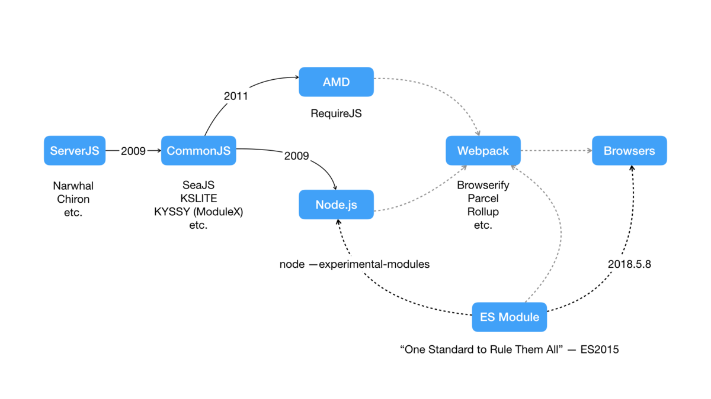

--

```js
// 1. 命名空间
// app.js
var app = {};

// hello.js
app.hello = {
	sayHi: function(){
        console.log('Hi');
    },
    sayHello: function(){
        console.log('Hello');
    }
}

// main.js
app.hello.sayHi();


// 2. 利用IIFE
var hello = (function (module1) {
    var module = {};

    var names = ['hanmeimei', 'lilei'];

    module.sayHi = function () {
        console.log(names[0]);
    };

    module.sayHello = function (lang) {
        console.log(names[2]);
    };

    return module;
}(module1));

// 3. 沙箱模式 （YUI3）
// hello.js
YUI.add('hello', function(Y) {
    Y.hello = {
        sayHi: function(){
          console.log('Hi');
        },
        sayHello: function(){
          console.log('Hello');
        }
    }
})

// main.js
YUI().use('hello', function(Y){
    Y.hello.sayHi();
    Y.DOM.doSomeThing();
},'3.0.0',{
    requires:['dom']
})

```

--

```js
//AMD for SPA
require(['page/index', 'page/detail'], function(index, detail){
    //在执行回调之前，index和detail模块的factory均执行过了
    switch(location.hash){
        case '#index':
            index();
        break;
        case '#detail':
            detail();
        break;
    }
});
```

--

> 以纯前端方式实现模块化框架不能**同时满足**按需加载，请求合并 和 依赖管理 三个需求{.fs28}

> 纯前端方式只能在运行时分析依赖关系 {.fs28 .fragment .fade-in}

--

::: block
举个🌰
{style=background:teal;width:400px;}
:::
<div class="grid-view two-col">
    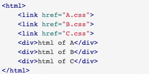
    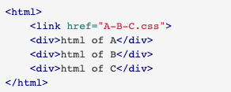
    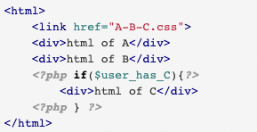
    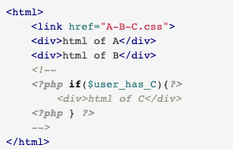
    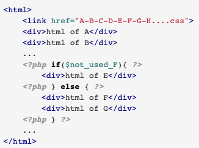
</div>

---

::: block
打包器的基础能力
{style=background:teal;width:400px;}
:::

<div class="flexbox fs28">
    <object data="./assets/pasted-image.pdf" type="application/pdf" width="400px" height="500px">
        <embed src="./assets/pasted-image.pdf">
            <p>This browser does not support PDFs. Please download the PDF to view it: <a href="./assets/pasted-image.pdf">Download PDF</a>.</p>
        </embed>
    </object>
    <ul class="tl">
        <li class="fragment" data-fragment-index="1">资源定位：</li>
        <p class="fs24 fragment" data-fragment-index="1">使用开发路径进行资源定位，项目发布后转换成部署路径 
</p>
        <li class="fragment" data-fragment-index="2">资源嵌入:</li>
        <p class="fs24 fragment" data-fragment-index="2">把一个资源的编译内容嵌入到另一个文件中</p>
        <li class="fragment" data-fragment-index="3">依赖声明:</li>
        <p class="fs24 fragment" data-fragment-index="3">声明一个资源依赖另一个资源的能力</p>
    </ul>
</div>


---

::: block
目录 
{style=background:teal;width:400px;}
::: 
-----
<ul>
    <li><a href="#/4">fis3基本原理</a></li>
    <li><a href="#/8">webpack基本原理</a></li>
    <li><a>bundless未来</a></li>
</ul>

---


::: block
fis3功能点
{style=background:teal;width:400px;}
:::

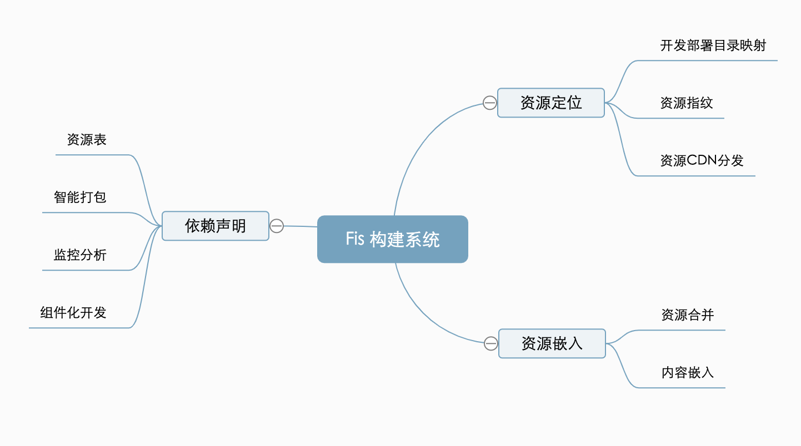


---

::: block
模块化开发
{style=background:teal;width:400px;}
:::
<div class="grid-view three-col">
    
    <ul class="fragment fs24" data-fragment-index="5">
        <li>组件化拆分</li>
        <li>分析依赖生成资源表</li>
        <li>运行时动态插入</li>
    </ul>
    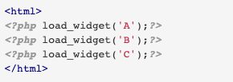
    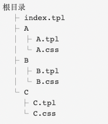
    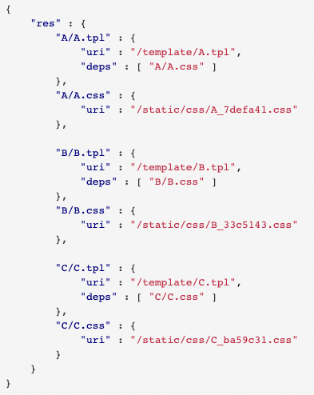
</div>

--

::: block
性能优化
{style=background:teal;width:400px;}
:::
<div class="grid-view two-col-opt">
    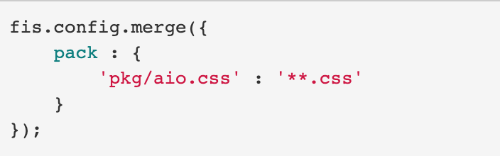
    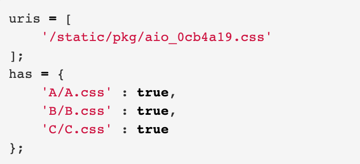
    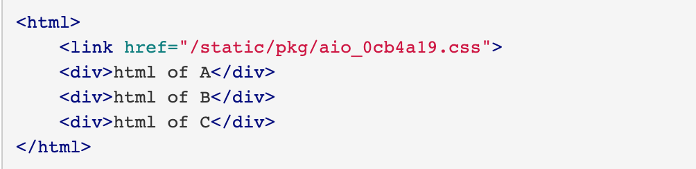
    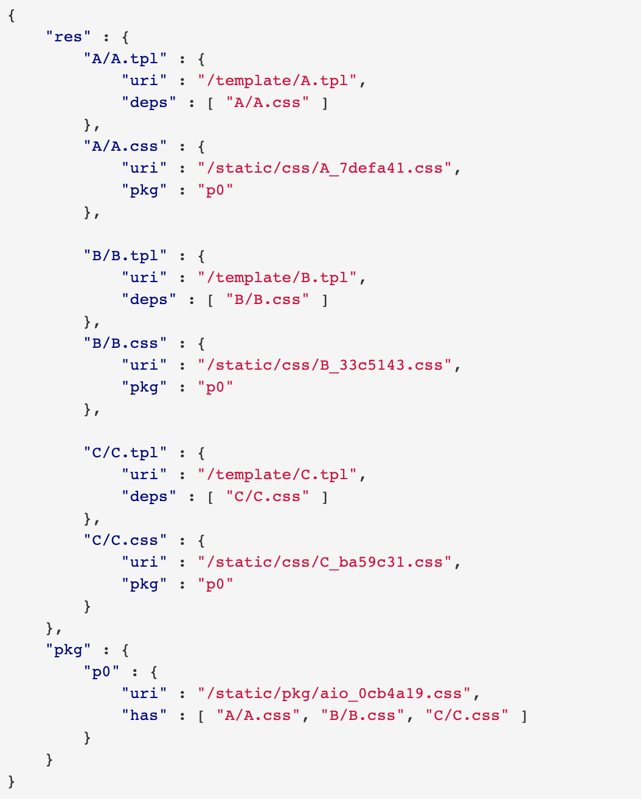
</div>

---

::: block
编译、打包过程
{style=background:teal;width:400px;}
:::
<ul class="fs28 p-mg10">
    <li>单文件编译</li>
    <p class="fs24">parser(编译器)：将源代码编译目标代码，比如 typescript->es2015</p>
    <p class="fs24">preprocessor(标准预处理器): 标准化前处理插件</p>
    <p class="fs24">standard(标准化处理)：处理内置语法，比如资源嵌入指令</p>
    <p class="fs24">postprocessor(标准后处理器)：标准化后处理插件</p>
    <p class="fs24">lint(校验器)：代码校验阶段，使用 fis release命令的 --lint 参数会调用该过程</p>
    <p class="fs24">test(测试器)：自动测试阶段，使用 fis release命令的 --test 参数会调用该过程</p>
    <p class="fs24">optimizer：代码优化阶段，使用 fis release命令的 --optimize 参数会调用该过程</p>
    <li>打包阶段</li>
    <p class="fs24">Prepackager (打包前处理插件)</p>
    <p class="fs24">packager(打包阶段处理插件)</p>
    <p class="fs24">Postpackager(打包后处理插件）</p>
    <p class="fs24">Command (命令行插件: 扩展 fis CLI 功能</p>
</ul>

---

::: block
webpack编译过程
{style=background:teal;width:400px;}
:::


---

::: block
Module单元
{style=background:teal;width:400px;}
:::
```js
module = {
  type,
  request,
  userRequest,
  rawRequest,
  loaders,
  resource,
  matchResource,
  parser,
  generator,
  resolveOptions
}
```

--

::: block
模块打包
{style=background:teal;width:400px;}
:::

```js
(function(modules) {
  var installedModules = {};
  function __webpack_require__(moduleId) {
    // 1.首先会检查模块缓存
    if (installedModules[moduleId]) {
      return installedModules[moduleId].exports;
    }
    // 2. 缓存不存在时，创建并缓存一个新的模块对象，类似Node中的new Module操作
    var module = (installedModules[moduleId] = {
      i: moduleId,
      l: false,
      exports: {},
    });
    // 3. 执行模块，类似于Node中的：
    // result = compiledWrapper.call(this.exports, this.exports, require, this, filename, dirname);
    modules[moduleId].call(
      module.exports,
      module,
      module.exports,
      __webpack_require__
    );
    module.l = true;

    // 4. 返回该module的输出
    return module.exports;
  }
  return __webpack_require__((__webpack_require__.s = 0));
})([
  /* 0 */
  function(module, exports, __webpack_require__) {
    var b = __webpack_require__(1);
    b();
  },
  /* 1 */
  function(module, exports) {
    module.exports = function() {
      console.log(11);
    };
  },
]);
```

---

::: block
同步依赖
{style=background:teal;width:400px;}
:::
```js
// webpack module chunk
window["webpackJsonp"].push([
    ["home-0"], // chunkIds
    {
        "module-home-0": (function(module, exports, __webpack_require__){ /* some logic */ }),
        "module-home-1": (function(module, exports, __webpack_require__){ /* some logic */ })
    },
    [["module-home-0","home-1"]]
])
```

--

```js
// webpack runtime chunk
function webpackJsonpCallback(data) {
    var chunkIds = data[0];
    var moreModules = data[1];
    var executeModules = data[2];

    var moduleId, chunkId, i = 0, resolves = [];
    // webpack会在installChunks中存储chunk的载入状态，据此判断chunk是否加载完毕
    for(;i < chunkIds.length; i++) {
        chunkId = chunkIds[i];
        if(installedChunks[chunkId]) {
            resolves.push(installedChunks[chunkId][0]);
        }
        installedChunks[chunkId] = 0;
    }
    
    // 注意，这里会进行“注册”，将模块暂存入内存中
    // 将module chunk中第二个数组元素包含的 module 方法注册到 modules 对象里
    for(moduleId in moreModules) {
        if(Object.prototype.hasOwnProperty.call(moreModules, moduleId)) {
            modules[moduleId] = moreModules[moduleId];
        }
    }

    if(parentJsonpFunction) parentJsonpFunction(data);

    // 对这些chunk的promise依赖进行resolve操作
    while(resolves.length) {
        resolves.shift()();
    }

    deferredModules.push.apply(deferredModules, executeModules || []);

    return checkDeferredModules();
};
```

--

```js
function checkDeferredModules() {
    var result;
    for(var i = 0; i < deferredModules.length; i++) {
        var deferredModule = deferredModules[i];
        var fulfilled = true;
        // 第一个元素是模块id，后面是其所需的chunk
        for(var j = 1; j < deferredModule.length; j++) {
            var depId = deferredModule[j];
            // 这里会首先判断模块所需chunk是否已经加载完毕
            if(installedChunks[depId] !== 0) fulfilled = false;
        }
        // 只有模块所需的chunk都加载完毕，该模块才会被执行（__webpack_require__）
        if(fulfilled) {
            deferredModules.splice(i--, 1);
            result = __webpack_require__(__webpack_require__.s = deferredModule[0]);
        }
    }
    return result;
}
```

--

::: block
异步依赖
{style=background:teal;width:400px;}
:::
```js
// require.ensure
if ( module.hot ) {
  require.ensure(['b'], function(require) {
    var c = require('c');
    // Do something special...
  });
}

// import()
if ( module.hot ) {
  import('lodash').then(_ => {
    // Do something with lodash (a.k.a '_')...
  });
}
```

--

```js
__webpack_require__.e = function requireEnsure(chunkId) {
    var promises = [];
    var installedChunkData = installedChunks[chunkId];
    
    // 判断该chunk是否已经被加载，0表示已加载。installChunk中的状态：
    // undefined：chunk未进行加载,
    // null：chunk preloaded/prefetched
    // Promise：chunk正在加载中
    // 0：chunk加载完毕
    if(installedChunkData !== 0) {
        // chunk不为null和undefined，则为Promise，表示加载中，继续等待
        if(installedChunkData) {
            promises.push(installedChunkData[2]);
        } else {
            // 注意这里installChunk的数据格式
            // 从左到右三个元素分别为resolve、reject、promise
            var promise = new Promise(function(resolve, reject) {
                installedChunkData = installedChunks[chunkId] = [resolve, reject];
            });
            promises.push(installedChunkData[2] = promise);

            // 下面代码主要是根据chunkId加载对应的script脚本
            var head = document.getElementsByTagName('head')[0];
            var script = document.createElement('script');
            var onScriptComplete;

            script.charset = 'utf-8';
            script.timeout = 120;
            if (__webpack_require__.nc) {
                script.setAttribute("nonce", __webpack_require__.nc);
            }
            
            // jsonpScriptSrc方法会根据传入的chunkId返回对应的文件路径
            script.src = jsonpScriptSrc(chunkId);

            onScriptComplete = function (event) {
                script.onerror = script.onload = null;
                clearTimeout(timeout);
                var chunk = installedChunks[chunkId];
                if(chunk !== 0) {
                    if(chunk) {
                        var errorType = event && (event.type === 'load' ? 'missing' : event.type);
                        var realSrc = event && event.target && event.target.src;
                        var error = new Error('Loading chunk ' + chunkId + ' failed.\n(' + errorType + ': ' + realSrc + ')');
                        error.type = errorType;
                        error.request = realSrc;
                        chunk[1](error);
                    }
                    installedChunks[chunkId] = undefined;
                }
            };
            var timeout = setTimeout(function(){
                onScriptComplete({ type: 'timeout', target: script });
            }, 120000);
            script.onerror = script.onload = onScriptComplete;
            head.appendChild(script);
        }
    }
    return Promise.all(promises);
};
```

---

::: block
分析统计
{style=background:teal;width:400px;}
:::
-----
- [speedMeasure](https://github.com/stephencookdev/speed-measure-webpack-plugin){.fs28}
- [bundleAnalyzer](https://github.com/webpack-contrib/webpack-bundle-analyzer){.fs28}
- [Visualizer](https://github.com/chrisbateman/webpack-visualizer){.fs28}

--

::: block
多进程
{style=background:teal;width:400px;}
:::
-----
- [happypack](https://github.com/amireh/happypack){.fs28}
- [UglifyJS](https://github.com/gdborton/webpack-parallel-uglify-plugin){.fs28}

--

::: block
node_modules缓存
{style=background:teal;width:400px;}
:::
-----
- [hardSource](https://github.com/mzgoddard/hard-source-webpack-plugin){.fs28}
- [dll](https://webpack.js.org/plugins/dll-plugin/){.fs28}

--

::: block
Webpack Federation
{style=background:teal;width:400px;}
:::
<ul class="tl fs28">
    <li>host：</li>
    <p class="fs24">在页面加载过程中（当 onLoad 事件被触发）最先被初始化的 webpack 构建</p>
    <li>remote：</li>
    <p class="fs24">部分被 “host” 消费的另一个 webpack 构建；</p>
    <li>Bidirectional hosts</li>
    <p class="fs24">当一个 bundle 或者 webpack build 作为一个 host 或 remote 运行时，它要么消费其他应用，要么被其他应用消费——均发生在运行时(runtime)</p>
</ul>

---

> You should be able to use a bundler because you want to, but not because you need to.

--

::: block
[bundless](http://calculist.org/blog/2012/06/29/static-module-resolution/)
{style=background:teal;width:300px;}
:::
-----
- [snowpack](https://www.snowpack.dev/){.fs28}
- [esbuild](http://docs.breword.com/evanw-esbuild/){.fs28}

--


::: block
[优势](http://calculist.org/blog/2012/06/29/static-module-resolution/)
{style=background:teal;width:400px;}
:::
1. snowpack遍历应用依赖，找出用到的npm包{.fs28}
1. 将node_modules对应的CommomnJS包转化成ES Module，存放到web_modules下{.fs28}
1. 后续构建则直接读取{.fs28}

---

::: block
资料 
{style=background:teal;width:400px;}
::: 

-----

1. [使用webpack4提升180%编译速度](http://louiszhai.github.io/2019/01/04/webpack4/)
1. [webpack 透视——提高工程化（原理篇）](https://blog.didiyun.com/index.php/2019/12/06/wepack-%e9%80%8f%e8%a7%86-%e6%8f%90%e9%ab%98%e5%b7%a5%e7%a8%8b%e5%8c%96%ef%bc%88%e5%ae%9e%e8%b7%b5%e7%af%87%ef%bc%89/)
1. [quicklink](https://github.com/GoogleChromeLabs/quicklink)
1. [前端工程与模块化框架](https://github.com/fouber/blog/issues/4)
1. [Webpack Federation](https://www.youtube.com/playlist?list=PLWSiF9YHHK-DqsFHGYbeAMwbd9xcZbEWJ)
